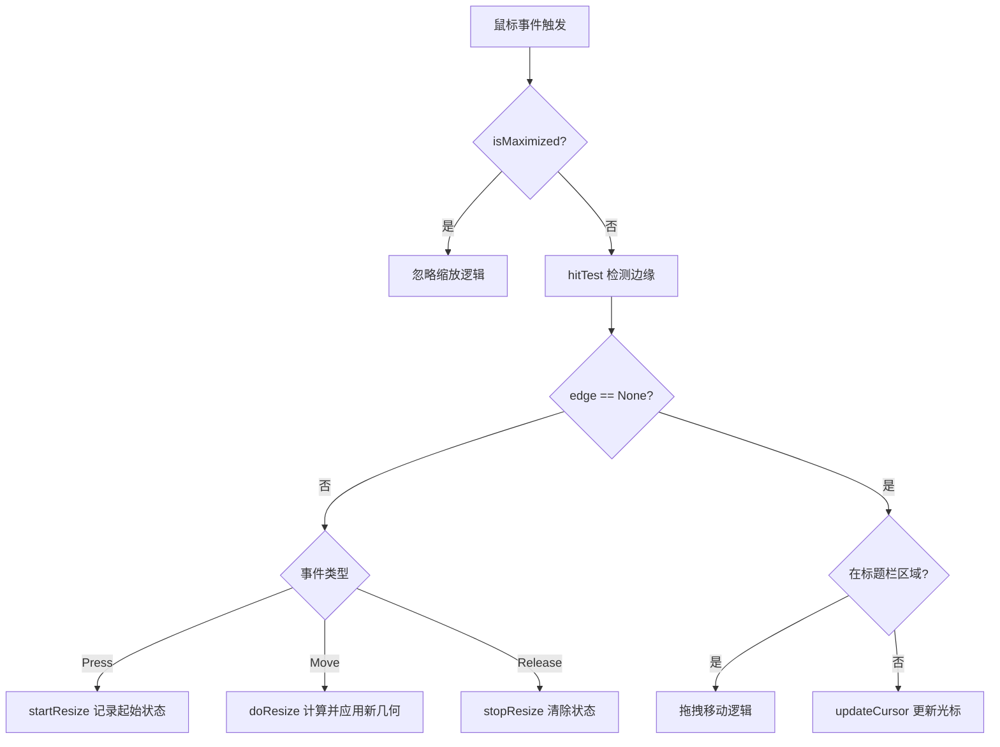

# 无边框窗口边缘缩放实现指导

> 对应开发文档一期功能：**鼠标拖拽窗口四边/四角可调整大小**
> 基于项目现有代码（`MainWindow`）进行扩展，新增 `WindowHelper` 工具类

---

## 目录

1. [功能分析](#1-功能分析)
2. [整体设计方案](#2-整体设计方案)
3. [核心概念：边缘区域检测](#3-核心概念边缘区域检测)
4. [WindowHelper 类设计](#4-windowhelper-类设计)
5. [完整代码实现](#5-完整代码实现)
6. [MainWindow 集成](#6-mainwindow-集成)
7. [关键细节与常见问题](#7-关键细节与常见问题)

---

## 1. 功能分析

### 需要实现的行为

| 鼠标位置 | 光标形状 | 拖拽效果 |
|----------|----------|----------|
| 左边缘 | `SizeHorCursor` (←→) | 调整宽度，左边界移动 |
| 右边缘 | `SizeHorCursor` (←→) | 调整宽度，右边界移动 |
| 上边缘 | `SizeVerCursor` (↑↓) | 调整高度，上边界移动 |
| 下边缘 | `SizeVerCursor` (↑↓) | 调整高度，下边界移动 |
| 左上角 | `SizeFDiagCursor` (↖↘) | 同时调整左边和上边 |
| 右下角 | `SizeFDiagCursor` (↖↘) | 同时调整右边和下边 |
| 右上角 | `SizeBDiagCursor` (↗↙) | 同时调整右边和上边 |
| 左下角 | `SizeBDiagCursor` (↗↙) | 同时调整左边和下边 |
| 标题栏内部 | `ArrowCursor` | 拖拽移动（已实现） |
| 其他区域 | `ArrowCursor` | 无操作 |

### 约束条件

- 最大化状态下**禁止**缩放（也禁止拖拽移动）
- 缩放时需要遵守 `minimumSize()` 限制
- 阴影边距（`SHADOW_MARGIN = 10`）是透明区域，**不参与**缩放检测
- 缩放检测区域在**实际内容边缘**（阴影内侧）

---

## 2. 整体设计方案

### 方案选择

| 方案 | 原理 | 优点 | 缺点 |
|------|------|------|------|
| **方案A：鼠标事件（推荐）** | 重写 `mousePressEvent` / `mouseMoveEvent` / `mouseReleaseEvent`，手动计算缩放 | 跨平台，代码可控 | 需要手动处理边界计算 |
| 方案B：`nativeEvent` (WM_NCHITTEST) | 拦截 Windows 原生消息，返回 `HTLEFT` 等 | 系统级支持，效果最好 | 仅 Windows，代码复杂 |

本项目选择**方案A**，封装到独立的 `WindowHelper` 工具类中，保持 `MainWindow` 代码整洁。

### 文件结构

```
src/utils/
├── windowhelper.h      # WindowHelper 类声明
└── windowhelper.cpp    # WindowHelper 类实现
```

### 数据流

```
鼠标移动
    │
    ▼
MainWindow::mouseMoveEvent()
    │
    ▼
WindowHelper::updateCursor()   ← 检测鼠标在哪个边缘区域
    │                              更新光标形状
    ▼
鼠标按下
    │
    ▼
MainWindow::mousePressEvent()
    │
    ▼
WindowHelper::startResize()    ← 记录起始状态（鼠标位置、窗口几何）
    │
    ▼
鼠标拖拽
    │
    ▼
MainWindow::mouseMoveEvent()
    │
    ▼
WindowHelper::doResize()       ← 根据拖拽偏移量计算新的窗口几何并应用
    │
    ▼
鼠标释放
    │
    ▼
MainWindow::mouseReleaseEvent()
    │
    ▼
WindowHelper::stopResize()     ← 清除缩放状态
```

---

## 3. 核心概念：边缘区域检测

### 坐标系说明

```
┌──────────────────────────────────────┐  ← 整个 QWidget（含阴影）
│  SHADOW_MARGIN (透明阴影区域)         │
│  ┌────────────────────────────────┐  │  ← contentRect（实际内容区）
│  │  RESIZE_MARGIN (缩放检测区域)  │  │
│  │  ┌──────────────────────────┐ │  │
│  │  │                          │ │  │
│  │  │      窗口内容区域         │ │  │
│  │  │                          │ │  │
│  │  └──────────────────────────┘ │  │
│  │  RESIZE_MARGIN (缩放检测区域)  │  │
│  └────────────────────────────────┘  │
│  SHADOW_MARGIN (透明阴影区域)         │
└──────────────────────────────────────┘
```

### 关键参数

```cpp
// 阴影边距（透明区域，不参与缩放检测）
static constexpr int SHADOW_MARGIN = 10;

// 缩放检测区域宽度（在内容边缘内外各延伸的像素数）
static constexpr int RESIZE_MARGIN = 6;
```

### 边缘区域判断逻辑

```
实际内容矩形 = rect().adjusted(SHADOW_MARGIN, SHADOW_MARGIN,
                               -SHADOW_MARGIN, -SHADOW_MARGIN)

左边缘区域：x ∈ [contentLeft - RESIZE_MARGIN, contentLeft + RESIZE_MARGIN]
右边缘区域：x ∈ [contentRight - RESIZE_MARGIN, contentRight + RESIZE_MARGIN]
上边缘区域：y ∈ [contentTop - RESIZE_MARGIN, contentTop + RESIZE_MARGIN]
下边缘区域：y ∈ [contentBottom - RESIZE_MARGIN, contentBottom + RESIZE_MARGIN]

左上角 = 左边缘 AND 上边缘
右上角 = 右边缘 AND 上边缘
左下角 = 左边缘 AND 下边缘
右下角 = 右边缘 AND 下边缘
```

---

## 4. WindowHelper 类设计

### 枚举：缩放方向

```cpp
enum class ResizeEdge {
    None,        // 不在边缘
    Left,        // 左边缘
    Right,       // 右边缘
    Top,         // 上边缘
    Bottom,      // 下边缘
    TopLeft,     // 左上角
    TopRight,    // 右上角
    BottomLeft,  // 左下角
    BottomRight  // 右下角
};
```

### 类接口设计

```cpp
class WindowHelper {
public:
    explicit WindowHelper(QWidget* window, int shadowMargin, int resizeMargin);

    // 检测鼠标位置对应的边缘方向
    ResizeEdge hitTest(const QPoint& pos) const;

    // 根据边缘方向更新鼠标光标形状
    void updateCursor(ResizeEdge edge);

    // 开始缩放：记录起始状态
    void startResize(ResizeEdge edge, const QPoint& globalPos);

    // 执行缩放：根据当前鼠标位置计算并应用新几何
    void doResize(const QPoint& globalPos);

    // 结束缩放：清除状态
    void stopResize();

    // 是否正在缩放
    bool isResizing() const;

private:
    QWidget*    window_;          // 目标窗口
    int         shadowMargin_;    // 阴影边距
    int         resizeMargin_;    // 缩放检测区域宽度

    // 缩放状态
    bool        resizing_ = false;
    ResizeEdge  resizeEdge_ = ResizeEdge::None;
    QPoint      resizeStartGlobalPos_;   // 开始缩放时的全局鼠标位置
    QRect       resizeStartGeometry_;    // 开始缩放时的窗口几何
};
```

---

## 5. 完整代码实现

### windowhelper.h

```cpp
#pragma once

#include <QWidget>
#include <QPoint>
#include <QRect>

// ============================================================
// ResizeEdge —— 缩放方向枚举
// ============================================================
enum class ResizeEdge {
    None,
    Left,
    Right,
    Top,
    Bottom,
    TopLeft,
    TopRight,
    BottomLeft,
    BottomRight
};

// ============================================================
// WindowHelper —— 无边框窗口缩放辅助类
//   · 检测鼠标位置对应的边缘方向
//   · 更新鼠标光标形状
//   · 执行窗口缩放逻辑
// ============================================================
class WindowHelper {
public:
    explicit WindowHelper(QWidget* window, int shadowMargin = 10, int resizeMargin = 6);

    ResizeEdge  hitTest(const QPoint& pos) const;
    void        updateCursor(ResizeEdge edge);
    void        startResize(ResizeEdge edge, const QPoint& globalPos);
    void        doResize(const QPoint& globalPos);
    void        stopResize();
    bool        isResizing() const { return resizing_; }

private:
    QWidget*    window_;
    int         shadowMargin_;
    int         resizeMargin_;

    bool        resizing_               = false;
    ResizeEdge  resizeEdge_             = ResizeEdge::None;
    QPoint      resizeStartGlobalPos_;
    QRect       resizeStartGeometry_;
};
```

### windowhelper.cpp

```cpp
#include "windowhelper.h"
#include <QCursor>

WindowHelper::WindowHelper(QWidget* window, int shadowMargin, int resizeMargin)
    : window_(window)
    , shadowMargin_(shadowMargin)
    , resizeMargin_(resizeMargin)
{
}

// ----------------------------------------------------------------
// hitTest —— 检测鼠标位置对应的边缘方向
//   pos：相对窗口自身的鼠标坐标（来自 event->position().toPoint()）
// ----------------------------------------------------------------
ResizeEdge WindowHelper::hitTest(const QPoint& pos) const
{
    // 实际内容矩形（去掉阴影区域）
    QRect content = window_->rect().adjusted(
        shadowMargin_, shadowMargin_,
        -shadowMargin_, -shadowMargin_
    );

    int x = pos.x();
    int y = pos.y();

    // 判断是否在各边缘区域内
    bool onLeft   = (x >= content.left()  - resizeMargin_) &&
                    (x <= content.left()  + resizeMargin_);
    bool onRight  = (x >= content.right() - resizeMargin_) &&
                    (x <= content.right() + resizeMargin_);
    bool onTop    = (y >= content.top()   - resizeMargin_) &&
                    (y <= content.top()   + resizeMargin_);
    bool onBottom = (y >= content.bottom()- resizeMargin_) &&
                    (y <= content.bottom()+ resizeMargin_);

    // 必须在内容矩形的扩展范围内（防止检测到窗口外部）
    bool inXRange = (x >= content.left()  - resizeMargin_) &&
                    (x <= content.right() + resizeMargin_);
    bool inYRange = (y >= content.top()   - resizeMargin_) &&
                    (y <= content.bottom()+ resizeMargin_);

    if (!inXRange || !inYRange) return ResizeEdge::None;

    // 角优先于边
    if (onLeft  && onTop)    return ResizeEdge::TopLeft;
    if (onRight && onTop)    return ResizeEdge::TopRight;
    if (onLeft  && onBottom) return ResizeEdge::BottomLeft;
    if (onRight && onBottom) return ResizeEdge::BottomRight;
    if (onLeft)              return ResizeEdge::Left;
    if (onRight)             return ResizeEdge::Right;
    if (onTop)               return ResizeEdge::Top;
    if (onBottom)            return ResizeEdge::Bottom;

    return ResizeEdge::None;
}

// ----------------------------------------------------------------
// updateCursor —— 根据边缘方向设置鼠标光标形状
// ----------------------------------------------------------------
void WindowHelper::updateCursor(ResizeEdge edge)
{
    switch (edge) {
    case ResizeEdge::Left:
    case ResizeEdge::Right:
        window_->setCursor(Qt::SizeHorCursor);
        break;
    case ResizeEdge::Top:
    case ResizeEdge::Bottom:
        window_->setCursor(Qt::SizeVerCursor);
        break;
    case ResizeEdge::TopLeft:
    case ResizeEdge::BottomRight:
        window_->setCursor(Qt::SizeFDiagCursor);
        break;
    case ResizeEdge::TopRight:
    case ResizeEdge::BottomLeft:
        window_->setCursor(Qt::SizeBDiagCursor);
        break;
    default:
        window_->setCursor(Qt::ArrowCursor);
        break;
    }
}

// ----------------------------------------------------------------
// startResize —— 记录缩放起始状态
// ----------------------------------------------------------------
void WindowHelper::startResize(ResizeEdge edge, const QPoint& globalPos)
{
    resizing_               = true;
    resizeEdge_             = edge;
    resizeStartGlobalPos_   = globalPos;
    // 记录窗口当前的屏幕几何（含阴影）
    resizeStartGeometry_    = window_->frameGeometry();
}

// ----------------------------------------------------------------
// doResize —— 根据鼠标偏移量计算并应用新的窗口几何
// ----------------------------------------------------------------
void WindowHelper::doResize(const QPoint& globalPos)
{
    if (!resizing_) return;

    // 鼠标偏移量
    QPoint delta = globalPos - resizeStartGlobalPos_;
    QRect  geo   = resizeStartGeometry_;
    QSize  minSz = window_->minimumSize();

    int newLeft   = geo.left();
    int newTop    = geo.top();
    int newRight  = geo.right();
    int newBottom = geo.bottom();

    // 根据缩放方向调整对应边
    switch (resizeEdge_) {
    case ResizeEdge::Left:
        newLeft = geo.left() + delta.x();
        break;
    case ResizeEdge::Right:
        newRight = geo.right() + delta.x();
        break;
    case ResizeEdge::Top:
        newTop = geo.top() + delta.y();
        break;
    case ResizeEdge::Bottom:
        newBottom = geo.bottom() + delta.y();
        break;
    case ResizeEdge::TopLeft:
        newLeft = geo.left() + delta.x();
        newTop  = geo.top()  + delta.y();
        break;
    case ResizeEdge::TopRight:
        newRight = geo.right() + delta.x();
        newTop   = geo.top()   + delta.y();
        break;
    case ResizeEdge::BottomLeft:
        newLeft   = geo.left()   + delta.x();
        newBottom = geo.bottom() + delta.y();
        break;
    case ResizeEdge::BottomRight:
        newRight  = geo.right()  + delta.x();
        newBottom = geo.bottom() + delta.y();
        break;
    default:
        return;
    }

    // 应用最小尺寸约束（防止窗口被拖到比最小尺寸还小）
    if (newRight - newLeft < minSz.width()) {
        // 根据拖拽的是左边还是右边来固定另一侧
        if (resizeEdge_ == ResizeEdge::Left ||
            resizeEdge_ == ResizeEdge::TopLeft ||
            resizeEdge_ == ResizeEdge::BottomLeft) {
            newLeft = newRight - minSz.width();
        } else {
            newRight = newLeft + minSz.width();
        }
    }
    if (newBottom - newTop < minSz.height()) {
        if (resizeEdge_ == ResizeEdge::Top ||
            resizeEdge_ == ResizeEdge::TopLeft ||
            resizeEdge_ == ResizeEdge::TopRight) {
            newTop = newBottom - minSz.height();
        } else {
            newBottom = newTop + minSz.height();
        }
    }

    // 应用新几何
    window_->setGeometry(newLeft, newTop,
                         newRight - newLeft,
                         newBottom - newTop);
}

// ----------------------------------------------------------------
// stopResize —— 清除缩放状态，恢复默认光标
// ----------------------------------------------------------------
void WindowHelper::stopResize()
{
    resizing_   = false;
    resizeEdge_ = ResizeEdge::None;
    window_->setCursor(Qt::ArrowCursor);
}
```

---

## 6. MainWindow 集成

### 修改 mainwindow.h

在现有代码基础上，添加以下内容：

```cpp
// 新增头文件引用
#include "../../utils/windowhelper.h"

// 在 private 成员区域新增
private:
    // ---- 边缘缩放 ----
    WindowHelper* window_helper_ = nullptr;
    static constexpr int RESIZE_MARGIN = 6;  // 缩放检测区域宽度
```

### 修改 mainwindow.cpp

**① 构造函数中初始化 WindowHelper**

```cpp
MainWindow::MainWindow(QWidget* parent)
    : QWidget(parent)
{
    // ... 现有代码 ...

    // 初始化缩放辅助类
    window_helper_ = new WindowHelper(this, SHADOW_MARGIN, RESIZE_MARGIN);

    initUI();
    connectSignals();
    restoreWindowState();
}
```

**② 修改 mousePressEvent —— 区分拖拽移动和缩放**

```cpp
void MainWindow::mousePressEvent(QMouseEvent* event)
{
    if (event->button() == Qt::LeftButton && !isMaximized()) {
        QPoint pos = event->position().toPoint();

        // 优先检测边缘缩放
        ResizeEdge edge = window_helper_->hitTest(pos);
        if (edge != ResizeEdge::None) {
            window_helper_->startResize(edge, event->globalPosition().toPoint());
            event->accept();
            return;
        }

        // 标题栏区域：拖拽移动
        int titleBottom = SHADOW_MARGIN + TITLE_BAR_HEIGHT;
        if (pos.y() <= titleBottom && pos.y() >= SHADOW_MARGIN) {
            m_dragStartPos = event->globalPosition().toPoint() - frameGeometry().topLeft();
            m_isDragging = true;
            event->accept();
            return;
        }
    }
    QWidget::mousePressEvent(event);
}
```

**③ 修改 mouseMoveEvent —— 处理缩放和光标更新**

```cpp
void MainWindow::mouseMoveEvent(QMouseEvent* event)
{
    QPoint pos       = event->position().toPoint();
    QPoint globalPos = event->globalPosition().toPoint();

    // 正在缩放
    if (window_helper_->isResizing()) {
        window_helper_->doResize(globalPos);
        event->accept();
        return;
    }

    // 正在拖拽移动
    if (m_isDragging && (event->buttons() & Qt::LeftButton)) {
        if (isMaximized()) {
            showNormal();
            m_dragStartPos = QPoint(width() / 2, TITLE_BAR_HEIGHT / 2);
        }
        move(globalPos - m_dragStartPos);
        event->accept();
        return;
    }

    // 未按下鼠标：更新光标形状（悬停反馈）
    if (!isMaximized()) {
        ResizeEdge edge = window_helper_->hitTest(pos);
        window_helper_->updateCursor(edge);
    }

    QWidget::mouseMoveEvent(event);
}
```

**④ 修改 mouseReleaseEvent —— 结束缩放**

```cpp
void MainWindow::mouseReleaseEvent(QMouseEvent* event)
{
    if (event->button() == Qt::LeftButton) {
        if (window_helper_->isResizing()) {
            window_helper_->stopResize();
            event->accept();
            return;
        }
        m_isDragging = false;
        event->accept();
        return;
    }
    QWidget::mouseReleaseEvent(event);
}
```

### 修改 CMakeLists.txt

在 `target_sources` 或源文件列表中添加新文件：

```cmake
target_sources(${PROJECT_NAME} PRIVATE
    # ... 现有文件 ...
    src/utils/windowhelper.h
    src/utils/windowhelper.cpp
)
```

---

## 7. 关键细节与常见问题

### ⚠️ 问题1：最大化状态下不应触发缩放

**原因**：最大化时窗口铺满屏幕，边缘检测会误触发。

**解决**：在 `mousePressEvent` 和 `mouseMoveEvent` 中加 `!isMaximized()` 判断：
```cpp
if (event->button() == Qt::LeftButton && !isMaximized()) {
    // 缩放逻辑
}
```

---

### ⚠️ 问题2：缩放时窗口抖动

**原因**：`setGeometry()` 每次都重新计算，如果 delta 基于当前位置而非起始位置，会产生累积误差。

**解决**：`doResize()` 中始终基于**起始几何**（`resizeStartGeometry_`）加上**总偏移量**（`globalPos - resizeStartGlobalPos_`）来计算，而不是基于上一帧的位置：
```cpp
// ✅ 正确：基于起始状态 + 总偏移
QPoint delta = globalPos - resizeStartGlobalPos_;  // 总偏移
QRect  geo   = resizeStartGeometry_;               // 起始几何

// ❌ 错误：基于上一帧位置 + 帧间偏移（会累积误差）
QPoint delta = globalPos - lastGlobalPos_;
```

---

### ⚠️ 问题3：拖拽移动和边缘缩放冲突

**原因**：标题栏区域和边缘区域可能重叠（标题栏的左上角/右上角）。

**解决**：在 `mousePressEvent` 中**边缘检测优先**，只有边缘为 `None` 时才进入拖拽移动逻辑：
```cpp
// 先检测边缘
ResizeEdge edge = window_helper_->hitTest(pos);
if (edge != ResizeEdge::None) {
    // 缩放
    return;
}
// 再检测标题栏拖拽
if (pos.y() <= titleBottom) {
    // 移动
}
```

---

### ⚠️ 问题4：鼠标移出窗口后光标未恢复

**原因**：鼠标离开窗口时 `mouseMoveEvent` 不再触发，光标停留在缩放形状。

**解决**：重写 `leaveEvent`，在鼠标离开时恢复默认光标：
```cpp
// mainwindow.h 中声明
void leaveEvent(QEvent* event) override;

// mainwindow.cpp 中实现
void MainWindow::leaveEvent(QEvent* event)
{
    if (!window_helper_->isResizing()) {
        setCursor(Qt::ArrowCursor);
    }
    QWidget::leaveEvent(event);
}
```

---

### ⚠️ 问题5：阴影区域（透明区域）误触发缩放

**原因**：`SHADOW_MARGIN` 区域是透明的，鼠标可以点击到，但不应触发缩放。

**解决**：`hitTest()` 中的 `inXRange` / `inYRange` 检查确保只在内容矩形的扩展范围内检测，阴影区域（距内容边缘超过 `RESIZE_MARGIN`）返回 `None`。

---

### 光标形状速查

```cpp
Qt::ArrowCursor        // 默认箭头
Qt::SizeHorCursor      // 水平双箭头 ←→（左右边缘）
Qt::SizeVerCursor      // 垂直双箭头 ↑↓（上下边缘）
Qt::SizeFDiagCursor    // 斜向双箭头 ↖↘（左上/右下角）
Qt::SizeBDiagCursor    // 斜向双箭头 ↗↙（右上/左下角）
```

---

## 实现流程图


